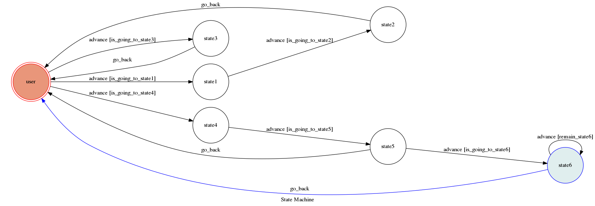

# TOC Project 2017

這是一個終極密碼的聊天機器人，要先註冊才能玩

## Setup

### Prerequisite
* Python 3


### Secret Data

`API_TOKEN` and `WEBHOOK_URL` in app.py **MUST** be set to proper values.
Otherwise, you might not be able to run your code.

### Run Locally
You can either setup https server or using `ngrok` as a proxy.

**`ngrok` would be used in the following instruction**

```sh
ngrok http 5000
```

After that, `ngrok` would generate a https URL.

You should set `WEBHOOK_URL` (in app.py) to `your-https-URL/hook`.

#### Run the sever

```sh
python3 app.py
```

## Finite State Machine


## Usage
The initial state is set to `user`.

Every time `user` state is triggered to `advance` to another state, it will `go_back` to `user` state after the bot replies corresponding message.

* user
	* Input: "new player"
		* Reply: "plz enter your name"
        * Input: "任意名稱"
            * Reply: "ok!"（名稱未使用）
            * Reply: "name already used"（名稱已使用）
	* Input: "all players"
		* Reply: "list:"(以下條列)
    * Input: "game"
        * Reply: "plz enter player's name"
        * Input: "任意名稱"
            * Reply: "unexist player"（名稱未註冊）
            * Reply: "game ready"（名稱已註冊）
                * Input: "任意數字"
                    * Reply: "數字～數字"（答錯）
                    * Reply: "bingo 分數"（答對）
